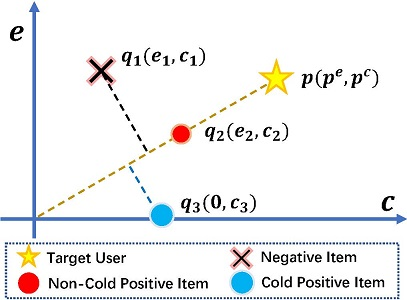
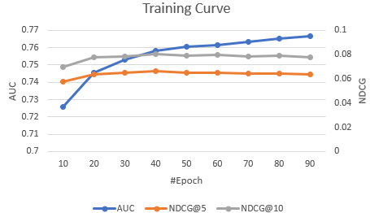

# Multi-Task Pairwise Ranking

**M**ulti-**T**ask **P**airwise **R**anking (MTPR) aims to address the discrepancy during the training process of cold-start recommendation. The discrepancy results in suboptimal item representation for multimedia recommendation.



We devised dual item representations consisting of two vectors, where N-rep indicates the normal representation that corresponds to all item representations and C-rep indicates the counterfactual representation that assumes the item is cold. We then proposed multi-task pairwise ranking, a loss function composed of four pairwise ranking branches, to optimize the representations with the target of modeling the correlations between non-cold and cold items.

This our official implementation for the paper:

> Xiaoyu Du, Xiang Wang, Xiangnan He, Zechao Li, Jinhui Tang, and Tat-Seng Chua, **How to Learn Item Representation for Cold-Start Multimedia Recommendation?**, in Proceedings of MM'20.

If you use the codes, please cite our paper. Thanks!

# Requirements

- Python==3.5
- Pytorch==1.4
- numpy, scipy, argparse, logging, sklearn, tqdm

# Quick Start



```
python main.python
```

# Dataset
The three datasets can be found here, <https://drive.google.com/file/d/1iKm2gHLuQ9X89l1Efq8Y9iJyRiV48sMu/view?usp=drive_link>

In this repository, we provide the dataset "amazon" in `amazon/men.npy`.

```
>>> import numpy as np
>>> data = np.load('amazon/men.npy', allow_pickle=True)
>>> data.item().keys()
dict_keys(['train', 'feat', 'val', 'test'])
>>> len(data.item()['train'])
27044
>>> len(data.item()['val'])
27044
>>> len(data.item()['test'])
27044
>>> data.item()['feat'].shape
(86506, 64)
```

